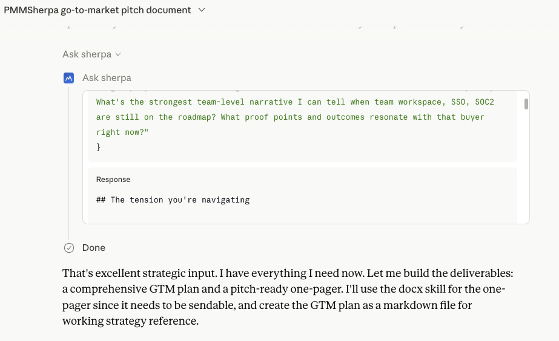
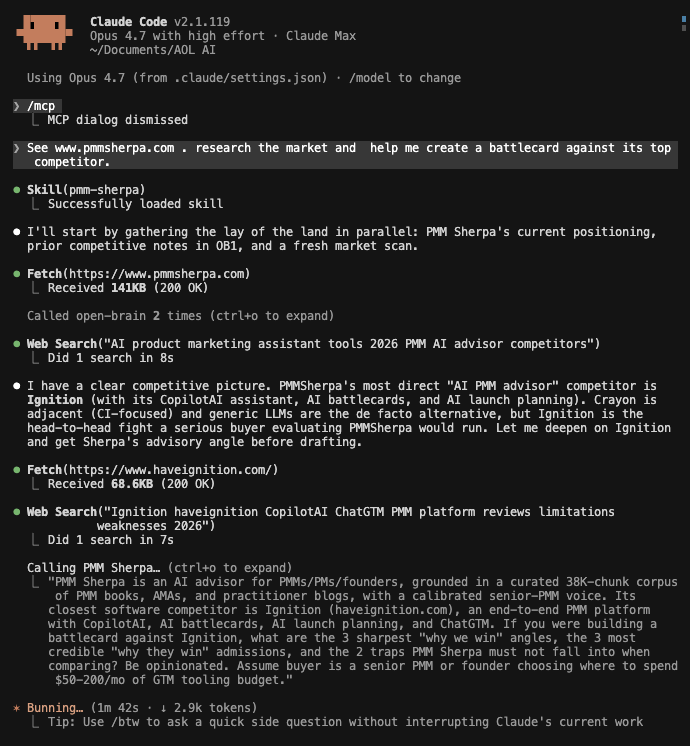
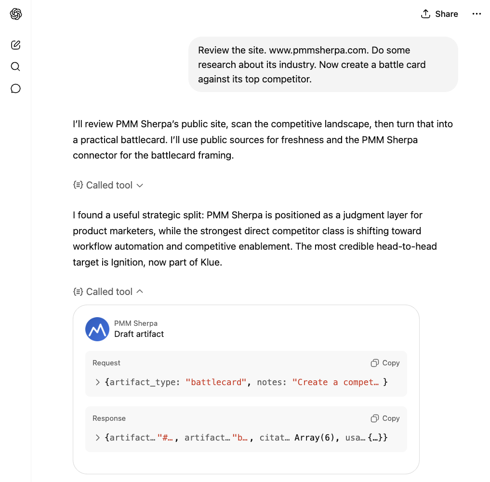

<h1 align="center">PMM Sherpa MCP</h1>

<p align="center">
  <strong>Senior product marketing judgment, in every AI you use.</strong>
  <br />
  <em>One MCP server. 38,000+ curated chunks of PMM wisdom. Four tools. Works across Claude.ai, Claude Code, ChatGPT, Codex, Gemini CLI, and Antigravity.</em>
</p>

<p align="center">
  <a href="https://github.com/boommark/pmmsherpa-mcp/blob/main/LICENSE"></a>
  <a href="#claude-ai"></a>
  <a href="#claude-code"></a>
  <a href="#chatgpt"></a>
  <a href="#codex"></a>
  <a href="#gemini-cli"></a>
  <a href="#antigravity"></a>
  <a href="https://pmmsherpa.com"></a>
</p>

<p align="center">
  
</p>

<p align="center">
  <strong>🏔️ <a href="https://pmmsherpa.com">Try Sherpa on the web</a></strong> &nbsp;|&nbsp;
  <strong>📖 <a href="https://pmmsherpa.com/docs">Full Docs</a></strong> &nbsp;|&nbsp;
  <strong>💬 <a href="https://github.com/boommark/pmmsherpa-mcp/discussions">Discussions</a></strong>
</p>

---

> **You're staring at a positioning doc, a launch plan, or a battlecard. You know the framework. You can't decide if you're applying it right.**
>
> PMM Sherpa is the senior PMM you wish you could DM at 11pm. It is a remote MCP server grounded in 38,000+ curated chunks from PMM books, AMAs, podcasts, and practitioner essays, with a calibrated advisory voice and four purpose-built tools. Connect it to whichever AI client you already use, and PMM judgment shows up in your normal flow, not in a new tab.

---

## ✨ The four tools

| Tool | When to use it | What it returns |
|---|---|---|
| **`ask_sherpa`** | Strategic framing, "is this right?", "how should I think about X?", open-ended PMM judgment | Advisory dialogue grounded in the corpus, in Layer 4 voice |
| **`draft_artifact`** | Generating one of 39 named PMM deliverables (positioning, messaging framework, ICP, persona, battlecard, landing page copy, launch plan, demo script, ad variants, comparison matrix, case study, analyst briefing, board deck, and more) | Structured deliverable with framework baked in |
| **`get_feedback`** | Pressure-testing a draft, landing page, deck, or copy you already have | Critique against senior PMM heuristics: gaps + recommendations |
| **`scope_pmm_research`** | Planning phase of a Deep Research run on a PMM-adjacent question | Research brief: angle, sub-questions, sources to weight, anti-patterns |

All four are grounded in the same corpus and speak the same voice. You orchestrate. Sherpa supplies the judgment.

---

## 🚀 Quick Start (60 seconds, Claude.ai)

The fastest path. If you have Claude.ai Pro/Max/Team/Enterprise:

1. Open Claude.ai → **Settings → Connectors → Add custom connector**
2. Name: `PMM Sherpa` &nbsp;·&nbsp; URL: `https://pmmsherpa.com/api/mcp` &nbsp;·&nbsp; Auth: OAuth
3. Sign in with the same Google account you use on [pmmsherpa.com](https://pmmsherpa.com)
4. (Recommended) Upload the [Claude.ai skill](skills/claude-ai/) so Sherpa auto-triggers on PMM keywords with the right voice
5. Ask: *"Help me sharpen positioning for [your product]."*

That's it. The connector is up. See it in action below.

<p align="center">
  
</p>

---

## 🌐 Multi-client install

Sherpa works in every modern MCP-capable AI client. Pick yours.

<details>
<summary><a id="claude-ai"></a><b>Claude.ai</b> (Pro, Max, Team, Enterprise) — recommended</summary>

### 1. Add the connector

Settings → **Connectors** → **Add custom connector**:

- **Name**: `PMM Sherpa`
- **MCP Server URL**: `https://pmmsherpa.com/api/mcp`
- **Authentication**: OAuth

Sign in with the same Google account as pmmsherpa.com. Approve.

### 2. Upload the skill (recommended)

Skills auto-trigger Sherpa on PMM keywords and enforce the Layer 4 voice across the conversation. Without one, you have to remember to toggle the connector and pick the right tool every time.

1. Download **[`skills/claude-ai/pmm-sherpa-skill.zip`](skills/claude-ai/pmm-sherpa-skill.zip)** from this repo
2. Claude.ai → Settings → **Capabilities** → **Skills** → **Upload skill**
3. Upload the zip → toggle ON

### 3. Try it

```
Help me build a battlecard against [competitor] for [your product].
```

The skill kicks in. PMM Sherpa is called automatically.

[Full Claude.ai setup](https://pmmsherpa.com/docs/connect-claude-ai)
</details>

<details>
<summary><a id="claude-code"></a><b>Claude Code</b> (CLI + IDE extensions)</summary>

### 1. Add the MCP server

```bash
claude mcp add pmm-sherpa --transport http https://pmmsherpa.com/api/mcp
```

On first call, Claude Code opens a browser for OAuth. Sign in with the same Google account as pmmsherpa.com.

### 2. Install the skill

```bash
git clone https://github.com/boommark/pmmsherpa-mcp.git ~/.pmm-sherpa
mkdir -p ~/.claude/skills
ln -s ~/.pmm-sherpa/skills/claude-code ~/.claude/skills/pmm-sherpa
```

The skill loads from `.claude/skills/pmm-sherpa/SKILL.md` on next session.

### 3. Try it

```
> /mcp
> See pmmsherpa.com. Help me create a battlecard against its top competitor.
```

<p align="center">
  
</p>

[Full Claude Code setup](https://pmmsherpa.com/docs/connect-claude-code)
</details>

<details>
<summary><a id="chatgpt"></a><b>ChatGPT</b> (Plus, Pro, Team, Business — Developer Mode)</summary>

### 1. Enable Developer Mode

Settings → **Connectors** → **Advanced** → toggle **Developer Mode** ON.

### 2. Add the connector

Settings → Connectors → **Create**:

- **Name**: `PMM Sherpa`
- **MCP Server URL**: `https://pmmsherpa.com/api/mcp`
- **Authentication**: OAuth
- **Trust**: "I trust this application"

Sign in with the same Google account as pmmsherpa.com.

### 3. Paste custom instructions

Settings → **Personalization** → **Custom Instructions** → paste the contents of **[`skills/chatgpt/custom-instructions.md`](skills/chatgpt/custom-instructions.md)** (~1,200 chars). This is the equivalent of the skill on ChatGPT, since ChatGPT does not yet support skills natively.

### 4. Try it

```
Help me sharpen the positioning for [your product] against [competitor].
```

Make sure the **PMM Sherpa** toggle is ON in the conversation's Tools panel.

<p align="center">
  
</p>

[Full ChatGPT setup](https://pmmsherpa.com/docs/connect-chatgpt)
</details>

<details>
<summary><a id="codex"></a><b>Codex CLI</b> (OpenAI)</summary>

```bash
codex mcp add pmm-sherpa --transport http https://pmmsherpa.com/api/mcp
```

OAuth flow opens in browser on first call. Use the ChatGPT custom-instructions block in your `~/.codex/instructions.md` to get skill-equivalent behavior.

[Full Codex setup](https://pmmsherpa.com/docs/connect-codex)
</details>

<details>
<summary><a id="gemini-cli"></a><b>Gemini CLI</b></summary>

Edit `~/.gemini/settings.json`:

```json
{
  "mcpServers": {
    "pmm-sherpa": {
      "transport": "http",
      "url": "https://pmmsherpa.com/api/mcp"
    }
  }
}
```

OAuth flow opens on first call. Paste the ChatGPT custom-instructions block into `~/.gemini/GEMINI.md` for skill-equivalent voice.

[Full Gemini CLI setup](https://pmmsherpa.com/docs/connect-gemini-cli)
</details>

<details>
<summary><a id="antigravity"></a><b>Antigravity</b></summary>

Settings → **MCP Servers** → **Add server**:

- **Name**: `pmm-sherpa`
- **URL**: `https://pmmsherpa.com/api/mcp`
- **Auth**: OAuth

[Full Antigravity setup](https://pmmsherpa.com/docs/connect-antigravity)
</details>

---

## 📦 Skills + custom instructions

Sherpa speaks a calibrated voice (Layer 4: discovery cadence, story-first, framework-named-mid, single-question close, never em-dashes). The skills enforce this voice and auto-route to the right tool.

| Client | Format | File |
|---|---|---|
| Claude.ai | Skill (zip) | [`skills/claude-ai/pmm-sherpa-skill.zip`](skills/claude-ai/pmm-sherpa-skill.zip) |
| Claude Code | Skill folder | [`skills/claude-code/`](skills/claude-code/) |
| ChatGPT | Custom Instructions text | [`skills/chatgpt/custom-instructions.md`](skills/chatgpt/custom-instructions.md) |
| Codex / Gemini CLI / Antigravity | Use the ChatGPT-style custom instructions | Same file as ChatGPT |

Without the skill, Sherpa still works. You just have to remember to toggle the connector ON and pick the right tool. With the skill, it picks correctly on its own.

---

## 💡 Examples

Four sample workflows, end-to-end:

- [**Positioning sharpening in Claude.ai**](examples/positioning-claude-ai.md). From rough draft to crisp positioning statement, with one Sherpa call.
- [**Launch deck via skill in Claude Code**](examples/launch-deck-claude-code.md). Skill auto-fires, `draft_artifact` produces the deck outline.
- [**Battlecard in ChatGPT**](examples/battlecard-chatgpt.md). Custom instructions route to `draft_artifact`, response stays in voice.
- [**Deep Research with Sherpa**](examples/deep-research.md). `scope_pmm_research` plans, subagents call `ask_sherpa`, `get_feedback` synthesizes.

---

## 💰 Pricing

| Plan | Monthly | What you get |
|---|---|---|
| **Free** | $0 | 10 MCP credits / month. 2 credits per query. Try every tool. |
| **Starter** | $9.99 | 200 MCP credits / month. Unlimited use of [pmmsherpa.com](https://pmmsherpa.com) chat. Topup packs unlocked. |

**Topup packs** (one-time, never expire, Starter only):

| Pack | Credits | $/credit |
|---|---|---|
| $5 | 50 | $0.10 |
| $10 | 125 | $0.08 |
| $15 | 200 | $0.075 (best value) |

[See full pricing](https://pmmsherpa.com/#pricing) &nbsp;·&nbsp; [Purchase docs](https://pmmsherpa.com/docs/purchase-credits)

---

## 📚 The corpus

38,000+ chunks across 9 knowledge layers:

- 34 PMM books
- 583 podcast episodes (PMM Alliance, Sharebird, etc.)
- 532 Sharebird AMAs with senior practitioners
- 827 PMA practitioner blog posts
- 23 substacks from PMM thought leaders
- 790 thought-leader essays from named operators

The corpus is curated, not crawled. Every source is hand-picked for substance density. Want a source added? [Open a corpus request](https://github.com/boommark/pmmsherpa-mcp/issues/new?template=corpus_request.yml).

---

## 🎙️ Voice & cadence

Sherpa speaks in **Layer 4 voice**. Every response:

- Opens with your situation, not preamble. No "Great question."
- Tells the story before naming the framework.
- Varies paragraph length. Long build. Short punch. Question. Space.
- Closes with one question you take away. Never a menu of options.
- Never uses em-dashes. Period, comma, colon, or parentheses instead.
- References principles. Never names the authors, books, or podcasts in the corpus.
- Doesn't hedge ("it depends", "could be") when the corpus has a clear position.

Same voice senior PMMs use in private Slack DMs. It transfers if you install the skill.

---

## ❓ FAQ

<details>
<summary><b>How does the credit system work?</b></summary>

Each MCP tool call is 2 credits, flat. Free users get 10 monthly credits (resets on your anniversary date). Starter users get 200 monthly credits + can buy topup packs that never expire. Founders are unmetered.
</details>

<details>
<summary><b>Can I self-host Sherpa?</b></summary>

No. The corpus and the prompt-engineering live on Sherpa's servers. The MCP transport is the supported integration point.
</details>

<details>
<summary><b>What's the data privacy story?</b></summary>

Your prompts and Sherpa's responses are logged for observability (Langfuse traces tagged `surface:mcp`). We do not train models on your data. We do not sell or share with third parties.
</details>

<details>
<summary><b>Why doesn't Sherpa work in Claude.ai Free tier?</b></summary>

MCP connectors are gated to Pro/Max/Team/Enterprise on Claude.ai. Same on ChatGPT (Plus/Pro/Team/Business). Free tiers across major LLM providers do not support custom MCP connectors yet.
</details>

<details>
<summary><b>Does the corpus get updated?</b></summary>

Yes. New books, AMAs, and high-signal essays are added every month. Open a corpus request issue to flag a gap.
</details>

<details>
<summary><b>Why does Sherpa never name authors or books?</b></summary>

The voice is calibrated to teach principles, not parade sources. Naming authors creates false authority and breaks reading flow. Sherpa references the principle. The principle holds whether or not the source is named.
</details>

---

## 🤝 Contributing

This repo is the public docs and skill mirror. The Sherpa server itself is closed-source. We welcome:

- **Bug reports** and **feature requests** for the MCP server, skills, or docs ([open an issue](https://github.com/boommark/pmmsherpa-mcp/issues/new/choose))
- **Corpus requests**, books, AMAs, podcasts you want added ([open a corpus request](https://github.com/boommark/pmmsherpa-mcp/issues/new?template=corpus_request.yml))
- **Doc PRs** for the skill files, examples, or README

See [CONTRIBUTING.md](CONTRIBUTING.md) for the full guide.

---

## 📜 License

[MIT](LICENSE) for the docs, skills, and examples in this repo. The Sherpa server, corpus, and proprietary prompts are not open-sourced.

---

## 🙏 Acknowledgements

- The PMM community whose books, AMAs, podcasts, and essays form the corpus
- The MCP spec authors at Anthropic for designing the protocol that makes this possible
- The Vercel AI SDK team for the streaming + tool-calling primitives
- The Supabase team for pgvector
- Every PMM who beta-tested Sherpa and pushed back on bad outputs

---

<p align="center">
  <em>Built by <a href="https://pmmsherpa.com">DBAR LLC</a>. Sherpa speaks because senior PMMs bothered to write things down.</em>
</p>
